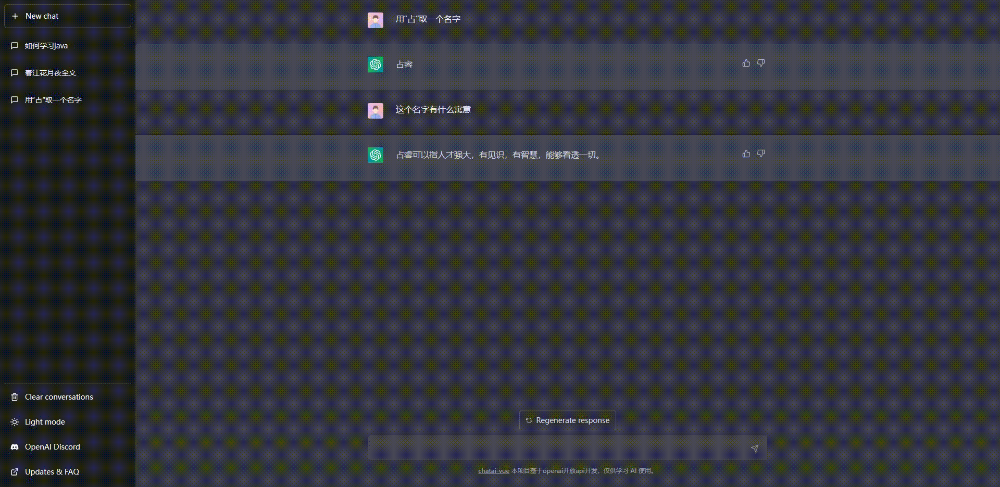
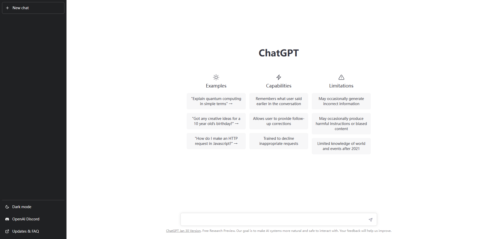
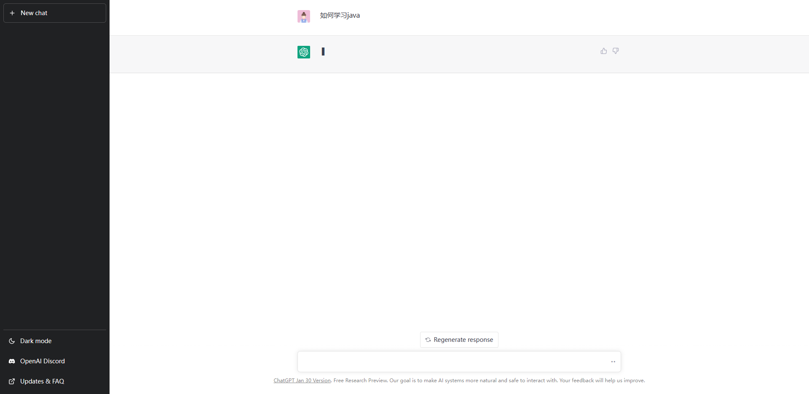
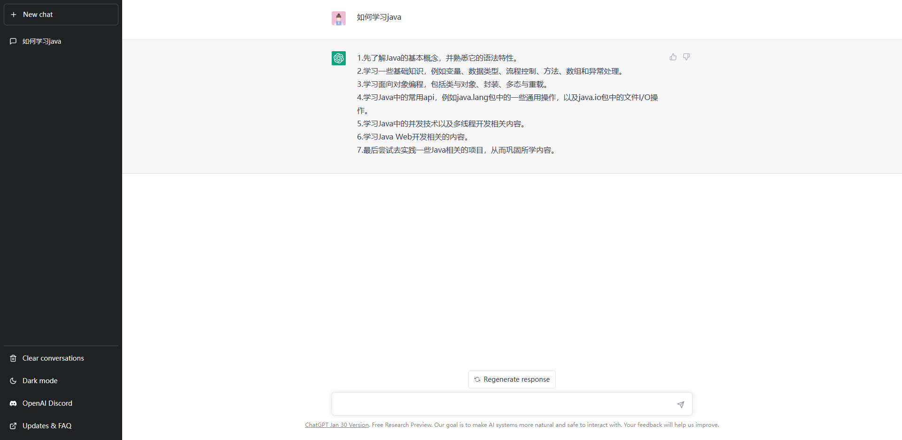
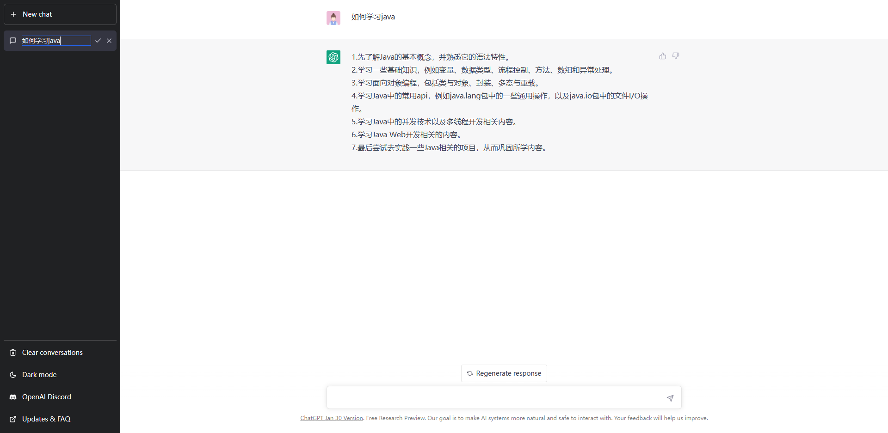
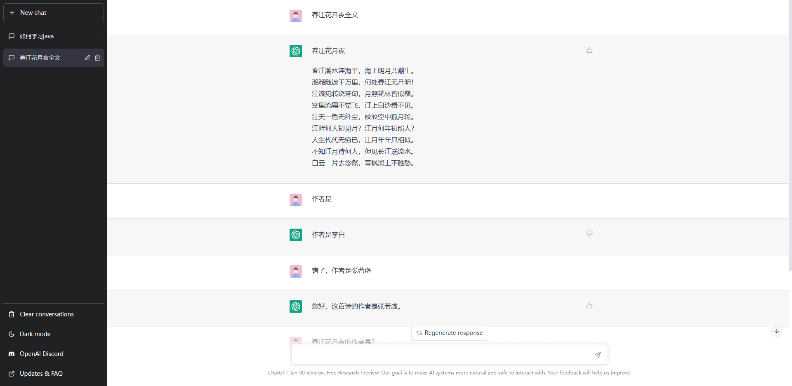
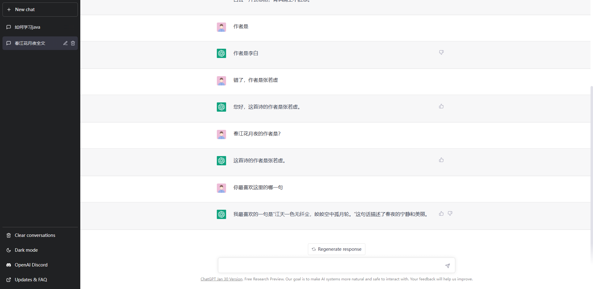

### chatai
使用vue高仿了chatgpt的前端，后端使用python flask openai实现。
3月2日，openai的api更新，开放了最新的gpt-3.5-turbo模型，后端使用了最新模型在分支toGpt3.5上，加上了流式响应。
新的模型更加强大，更加智能。
有能力的可以自行部署。

后端代码
[chatai-python](https://gitee.com/MIEAPP/chatai-python)


#### 使用代码（二次开发）
```
# 下载依赖
npm i

# 本地开发
npm run dev

# 打包
npm run build
```

#### 使用代码（直接使用）
dist目录就是打包好的代码，可以直接放在nginx的静态文件下。


视频演示
[视频](https://www.bilibili.com/video/BV1QA411C7mN/)

下面是前端演示截图：










注意：项目只是为了学习，请勿用于其他用途，一切后果使用者自行承担。